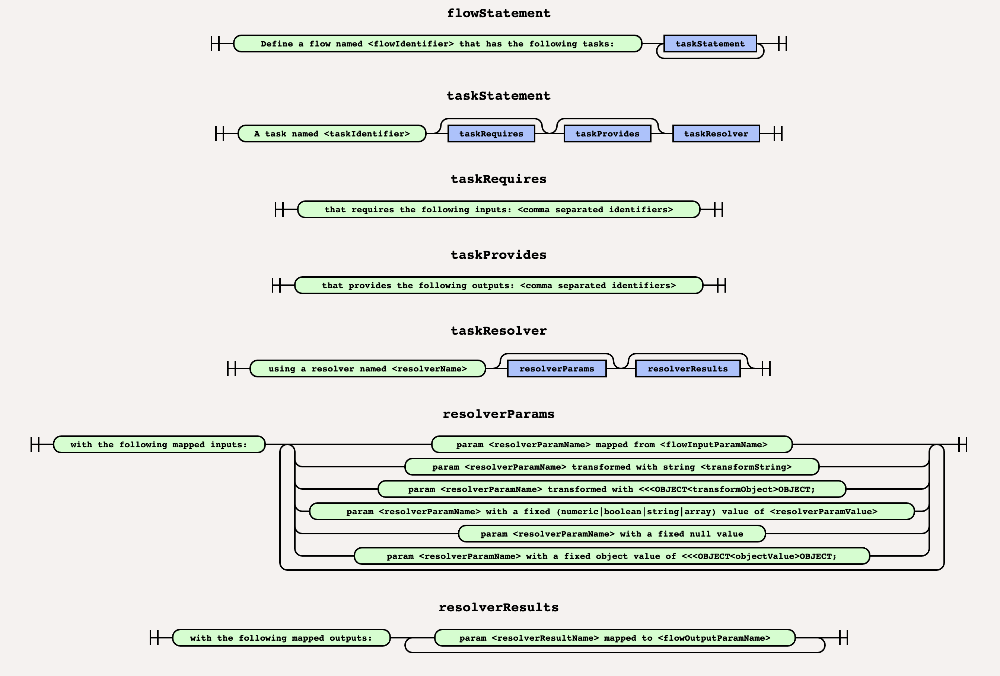

# Naturally

Naturally allows to write Flowed specs using natural language instead of JSON.


## TOC
  * [Example](#example)
  * [Grammar](#grammar)
    + [flowStatement](#flowstatement)
    + [taskStatement](#taskstatement)
    + [taskRequires](#taskrequires)
    + [taskProvides](#taskprovides)
    + [taskResolver](#taskresolver)
    + [resolverParams](#resolverparams)
      - [Mapped values](#mapped-values)
      - [String or number values](#string-or-number-values)
      - [Object or array values](#object-or-array-values)
      - [Null or boolean values](#null-or-boolean-values)
      - [Transformed Values](#transformed-values)
    + [resolverResults](#resolverresults)
  * [Usage](#usage)
  * [Installation](#installation)

## Example

```
Define a flow named testFlow that has the following tasks:
  A task named firstTask
    that requires the following inputs: someInput, someOtherInput
    that provides the following outputs: someOutput
    using a resolver named testResolver
      with the following mapped inputs:
        param p1 mapped from someInput
        param p2 mapped from someOtherInput
        param p3 transformed with "{{someInput.property}}";
        param p4 transformed with {
            "a1": "{{someInput.property}}",
            "a2": "{{someOtherInput.propertyB}}"
          };
        param p5 with value 123
        param p6 with value 456.789
        param p7 with value "sample string"
        param p8 with a null value,
        param p9 with a true value
        param p10 with a false value
        param p11 with value ["a", "b", "c"];
        param p12 with value {
            "a1": "123",
            "a2": true
          };
      with the following mapped outputs:
        param taskResult mapped to someOutput
```

Once parsed will return the following javascript object:

```json5
{
  code: 'testFlow',
  tasks: {
    firstTask: {
      requires: [ 'someInput', 'someOtherInput' ],
      provides: [ 'someOutput' ],
      resolver: {
        name: 'testResolver',
        params: {
          p1: 'someInput',
          p2: 'someOtherInput',
          p3: { transform: '{{someInput.property}}' },
          p4: {
            transform: {
              a1: '{{someInput.property}}',
              a2: '{{someOtherInput.propertyB}}'
            }
          },
          p5: { value: 123 },
          p6: { value: 456.789 },
          p7: { value: 'sample string' },
          p8: { value: null },
          p9: { value: true },
          p10: { value: false },
          p11: { value: [ 'a', 'b', 'c' ] },
          p12: { value: { a1: '123', a2: true } }
        },
        results: { taskResult: 'someOutput' }
      }
    }
  }
}
```

## Grammar

`naturally` follows the following grammar:



Let's see each section in detail.

### flowStatement

The flow statement is a string that matches the following RegEx:

```jsregexp
/Define a flow named ([._a-zA-Z][.\-_a-zA-Z0-9]+) that has the following tasks:/i
```

### taskStatement

The flow statement is a string that matches the following RegEx:

```jsregexp
/A task named ([._a-zA-Z][.\-_a-zA-Z0-9]+)/i
```

### taskRequires

The task requires statement is a string that matches the following RegEx:

```jsregexp
/that requires the following inputs: (([._a-zA-Z][.\-_a-zA-Z]+,\s?)*[._a-zA-Z][.\-_a-zA-Z]+)/i
```

### taskProvides

The task provides statement is a string that matches the following RegEx:

```jsregexp
/that provides the following outputs: (([._a-zA-Z][.\-_a-zA-Z]+,\s?)*[._a-zA-Z][.\-_a-zA-Z]+)/i
```

### taskResolver

The task resolver statement is a string that matches the following RegEx:

```jsregexp
/using a resolver named ([._a-zA-Z][.:\-_a-zA-Z0-9]+)/i
```

### resolverParams

Resolver params are basically two types of statements:

One statement that matches 

```jsregexp
/with the following mapped inputs:/i
```

followed by one or more of the statements:

#### Mapped values

A string that matches the following RegEx:

```jsregexp
/param ([._a-zA-Z][.\-_a-zA-Z0-9]+) mapped from ([._a-zA-Z][.\-_a-zA-Z0-9]+)/i
```


#### String or number values

String or number values statements are strings that matches the following RegEx:

```jsregexp
/param ([._a-zA-Z][.\-_a-zA-Z0-9]+) with value ((?<string>"(.*)")|(?<number>[\+\-]?\d*\.?\d+(?:[Ee][\+\-]?\d+)?))/i
```

#### Object or array values

Object or array values are a special construct that allows to define a JSON object (object or array) as param value. It's a string that matches the following RegEx:

```jsregexp
/param ([._a-zA-Z][.\-_a-zA-Z0-9]+) with value ((?<object>\{(.+)\});|(?<array>\[(.*)\]);)/si
```

Note the `s` modifier, that allows to write the object in multiple lines.
Also note that both object and array values should end with `};` or `];` respectively.

#### Null or boolean values

Null value is a special value and thus it have its own statement: a string that matches the following RegEx:

```jsregexp
/param ([._a-zA-Z][.\-_a-zA-Z0-9]+) with a (null|true|false) value/i
```

#### Transformed Values

Transformations values are strings that matches then follwoing RegEx:


```jsregexp
/param ([._a-zA-Z][.\-_a-zA-Z0-9]+) transformed with ((?<object>\{(.+)\});|(?<array>\[(.*)\]);|(?<string>"(.+)");)/si
 ```
Note the `s` modifier in the second RegEx, that allows to write the object in multiple lines.
Note that the expression support three types of transformations: object, array and string, each one should end with `;` or `];` or `";` respectively.

### resolverResults

Resolver results are two types of statements.

One statement that matches the following RegEx:

```jsregexp
/with the following mapped outputs:/i
```

followed by one or more statements matching the folloging RegEx:

```jsregexp
/param ([._a-zA-Z][.\-_a-zA-Z0-9]+) mapped to ([._a-zA-Z][.\-_a-zA-Z0-9]+)/i
```

*NOTE:* All regex have the `i` modifier in order to be case insensitive.


## Usage

```js
const { NaturallyParser } = require('naturally');

const naturallyFlowedExpression = `
Define a flow named testFlow that has the following tasks:
  A task named firstTask
    that requires the following inputs: someInput, someOtherInput
    that provides the following outputs: someOutput
    using a resolver named testResolver
      with the following mapped inputs:
        param p1 mapped from someInput
        param p2 mapped from someOtherInput
        param p3 transformed with "{{someInput.property}}";
        param p4 transformed with {
            "a1": "{{someInput.property}}",
            "a2": "{{someOtherInput.propertyB}}"
          };
        param p5 with value 123
        param p6 with value 456.789
        param p7 with value "sample string"
        param p8 with a null value,
        param p9 with a true value
        param p10 with a false value
        param p11 with value ["a", "b", "c"];
        param p12 with value {
            "a1": "123",
            "a2": true
          };
      with the following mapped outputs:
        param taskResult mapped to someOutput
`;

const parser = new NaturallyParser();
const jsonFlow = parser.parse(naturallyFlowedExpression);
console.log(jsonFlow);
```

## Installation

```shell script
npm install naturally
```